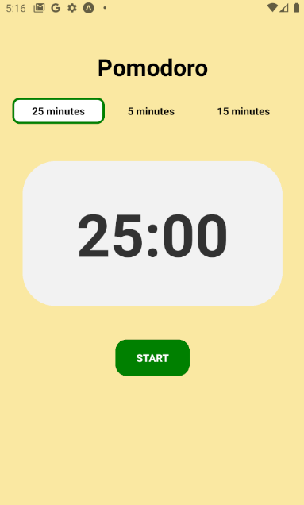
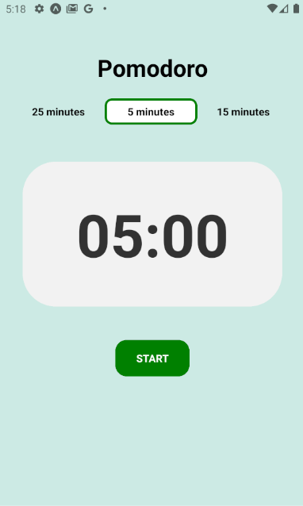
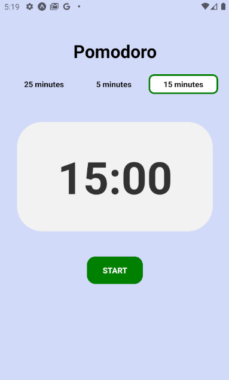

# Pomodoro 🍅 app for mobile

Hi, this is a React Native projet to create a pomodoro counter.

This application has 3 timers: 25 minutes, 15 minutes and 5 minutes.

Each timer has its own background to make it different from the other.

If you click start button, and you start counting. If you click stop, it will stop couting. If you want to reset the couters, just click on the timer (25, 15 or 5 minutes)

I have used sound effect when you click the button start, and also when the timing finish, it plays an little sound to indiquate that the time is over.

## Screenshots 📱

  
  
  
 

